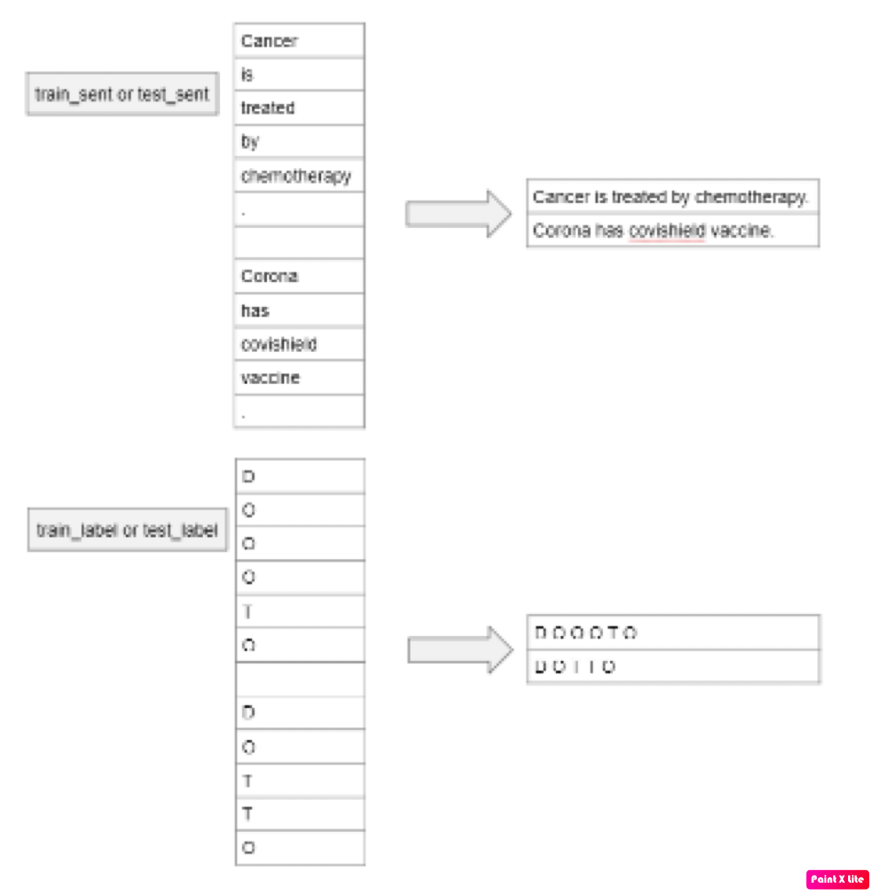

# Identifying Entities in Healthcare Data

This project focuses on extracting and classifying medical entities—specifically diseases and treatments—from structured healthcare text using a Conditional Random Field (CRF) model. The goal is to build a custom Named Entity Recognition (NER) system that can predict treatments for given diseases based on labeled data.

## 📂 Project Overview
Objective: Predict treatments for diseases using CRF-based sequence labeling.

Approach: Preprocess raw word-level data, extract linguistic features, train a CRF model, and build a disease-treatment dictionary using custom NER.

## 🧹 Data Preprocessing
The dataset is formatted with one word per line. Sentences are separated by empty lines, and labels follow the same structure.

Step 1: Reconstruct full sentences and their corresponding labels from the raw format.

Step 2: Apply the same logic to both training and test datasets.

The image provided illustrates this transformation—from raw word-level input to structured sentence-label pairs.